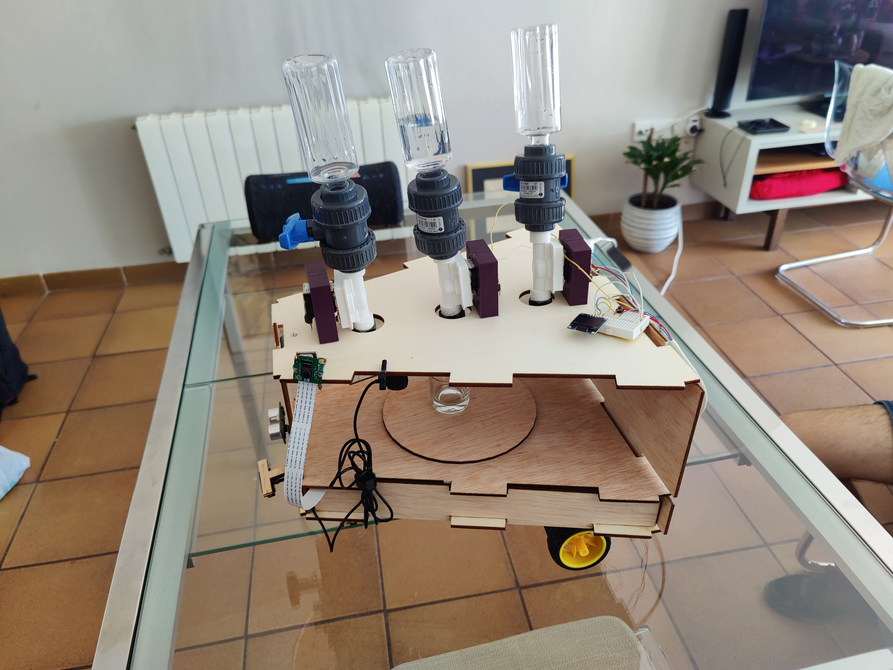
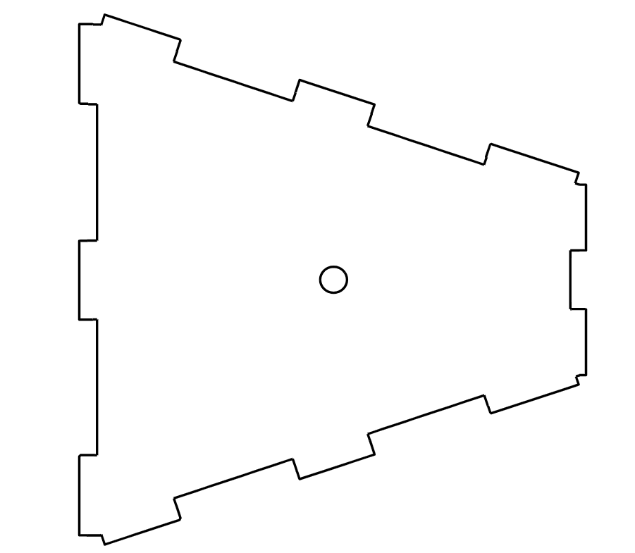
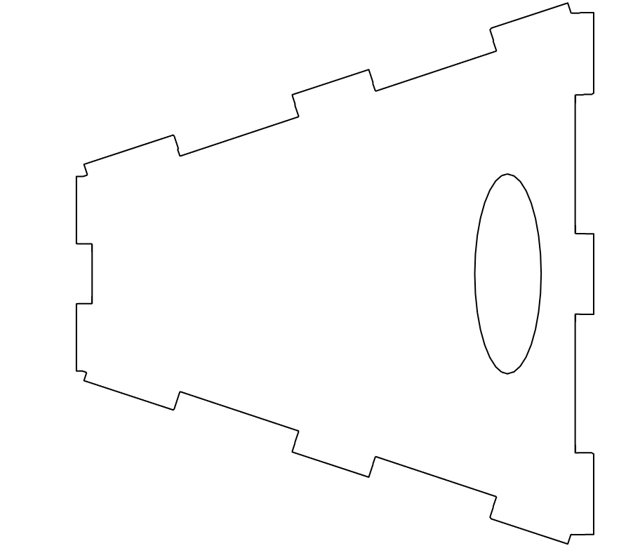
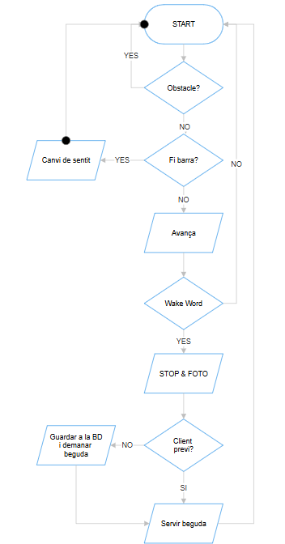

# Shotbot - Autonomous Shot-Serving Robot

# Table of Contents
   * [What is this?](#what-is-this)
   * [Requirements](#requirements)
   * [Installation](#installation)
   * [Hardware section](#hardware-section)
      * [3D Models](#3d-models)
      * [Components list](#components-list)
      * [Connections](#connections)
   * [Software section](#software-section)
      * [Movement](#movement)
      * [Audio](#audio)
      * [Serving shots](#serving-shots)
      * [Face detection](#face-detection)
   * [Video](#video)
   * [References](#references)
   * [Authors](#authors)

## What is this?
ShotBot is a small autonomous robot designed specifically for serving shots (drinks) in a bar setting. This project aims to create a new way for serving drinks by leveraging robotics technology. With its compact size and navigation system, ShotBot can maneuver through crowded bar spaces, delivering shots autonomously. Additionally, it is equipped with a camera for facial recognition and voice recognition capabilities, enhancing its interaction with customers.

## Requirements
For running this code, you need to install these languages and libraries:

- [Python 3.12.x](https://www.python.org/)
- [NumPy](https://numpy.org/)
- [Sklearn](https://scikit-learn.org/stable/)
- [Pillow](https://pillow.readthedocs.io/en/stable/)
- [opencv-python](https://pypi.org/project/opencv-python/)
- [luma.core](https://pypi.org/project/luma.core/)
- [PyAudio](https://pypi.org/project/PyAudio/)
- [Matplotlib](https://matplotlib.org/)
- [pygame](https://www.pygame.org/news)
- [wavefile](https://pypi.org/project/wavefile/)
- [RPi.GPIO](https://pypi.org/project/RPi.GPIO/)
- [pvleopard](https://pypi.org/project/pvleopard/)
- [pvporcupine](https://pypi.org/project/pvporcupine/)

## Installation
To set up ShotBot, follow these steps:
1. Clone the repository to your local machine.
2. Install the required libraries (check requirements).
3. Execute main Python script.

## Hardware section
The hardware library includes all the necessary components and designs for building Robowaiter's physical structure. It contains schematics, 3D designs, and hardware components to help you construct the robot.

### 3D Models
In the 3D library, you'll find printable designs for enclosures, mounts, and other physical structures required for Robowaiter. These designs are available to be 3D printed.
| 3D Piece             | Image                                                               | 3D Piece              | Image                                                                 |
|----------------------|---------------------------------------------------------------------|-----------------------|-----------------------------------------------------------------------|
|     Part superior            |                 | Base              |       |
| Part inferior         |            |   Part lateral x2  |            |
| Front  |              | Back |       |
| Suport infraroig x2  |              | Suport roda motor x2       |      |
| Suport roda boja   |       | Suport valvula x6    |    |
|Plataforma||

### Components list
| Component                   | Image | Component                   | Image |
|-----------------------------|-------|-----------------------------|-------|
| [Raspberry Pi 3](https://tienda.bricogeek.com/placas-raspberry-pi/1089-raspberry-pi-3-b-plus.html?search_query=raspberry+pi+3&results=126) |      | [Step-Up 3.3V to 12V](https://tienda.bricogeek.com/convertidores-de-voltaje/1004-conversor-step-upstep-down-33v1a-s7v8f3.html)            |      |
| [Controller L298N](https://tienda.bricogeek.com/motores/285-controlador-de-motores-doble-puente-h-l298.html?search_query=L298N&results=3)       |      | [Camera](https://es.aliexpress.com/item/4001162865845.html?spm=a2g0o.ppclist.product.2.3d91WN0rWN0rwh&pdp_npi=2%40dis%21EUR%21%E2%82%AC%203%2C69%21%E2%82%AC%202%2C76%21%21%21%21%21%40211b5dfd16539403796157400e6948%2112000018174400524%21btf&_t=pvid%3A9a5ddde9-5795-4052-80bd-c3985eeb8d6a&afTraceInfo=4001162865845__pc__pcBridgePPC__xxxxxx__1653940380&gatewayAdapt=glo2esp)  |      | 
| [PowerBank 10000mAh](https://www.amazon.es/Coolreall-10000mAh-Compacto-Pantalla-Compatible/dp/B0CQK1GVYD/ref=sr_1_8?dib=eyJ2IjoiMSJ9.BNQ0oJ0R8QnAysp9IQFEWejD_YE23eWgaeKRznOHfHiGOCODNp6GNintnKy4gze6tSG7krS2tmGv6vP1bBvgFzQOOvUIaeoKOEZjKel_ug5zSPl5IRZSyLt7OlZsHQXpcSEpcucIh3UuUmT31DOiQHSIzBnMA9AuKT7jfvlt-MxDQKnXq0Sz6ohRrwD7KDrBRaUzMc0WSQho7DEn2CUYnLdaI_ZXb5ZI_RWgrl5Q8-SiJZ6ay1J2O4bI5lYzwpLgSYmp-I_2GM6H1iaeMp0HpECztmoLt7RYt5mnqcZTDL8.3V1R3WidPHV4eKizSL-cSsSnuR4CghXxhQb2ZRNHKrg&dib_tag=se&keywords=bateria%2Bexterna%2B10000mah&qid=1709653049&sr=8-8&th=1)            |    |[Ultrasound sensor x2](https://tienda.bricogeek.com/sensores-distancia/741-sensor-de-distancia-por-ultrasonidos-hc-sr04.html) |   |
| [Solenoid Valve x3](https://tienda.bricogeek.com/otros-sensores/937-valvula-con-solenoide-12v.html)            |      | [IR Sensor x2](https://www.amazon.es/AZDelivery-infrarrojos-kollissions-obst%C3%A1culos-Detecci%C3%B3n/dp/B07D924JHT/ref=sr_1_5?dib=eyJ2IjoiMSJ9.boGIVuDzM7hVuouV7v5voBn685_8NBEPErCYVJnBtE5WKAHWVM_5j69Er13dMEHxk52uJFn-uXSY_FMQjTSHJ_iKhy3HMqgqcHDhSKWYAZQ9xx3YOuqU7J4Ip7xbVN6pntB1eODfC0CUZzi1DUJ1cZBL5Qw7JP8raphWSgqSTEUBEdiTxty8ysE04cBQDmhZzAwRgvkece4ErxfRKxM50_lbe-yFLy_2OCdWEEpfj3k_VsIS8fpTC7GODLcRYPNoo9vgnB1jEpIn3OAIhvMjkZCb6LNnLakEBmTQApc4AC0.FQcqwUx4-0Rph1_cMOLC17gPpZdQQB6ho7Cg21HW1C4&dib_tag=se&keywords=Arduino%2BIr%2BSensor&qid=1709761946&sr=8-5&th=1)            |     |      | [Batteries AA 1.5V x6](https://www.amazon.es/Verbatim-Pilas-Alcalino-Cil%C3%ADndrico-pieza/dp/B078TJF9WS/ref=sr_1_25?adgrpid=57795729258&dib=eyJ2IjoiMSJ9.L65noOE9_JgZ5YxJeGpMPpAVkV6TiZwh_KPSOj5x8ru4nhJMlju4TD7dhAZUGJ5dsvgaZwoHRP5AOkeUbM1PMP35-oBbrHNwgx2-sHIw0jgN1QZJMMkROWzQG51A1330Q_del9dCQ7lCLADiUxR4w4hQ8tM2LTn1G7oPyu-y_ADgc0dMgUvAzLHgBYP34AI6jCh1E8xXm6vCy0PCtuaQf03UEtP57_UwH7O2JP5i_zMgnvbtgW6906V5b3RSAYs_OgxDVui54MIQ4-9KdsU3t0S6IdEUjam9Pa4YZjs6HeE.QWQXNrBLZHMTtkF6p3l92fYSgsOD5w1fOYDnQi8Jo4I&dib_tag=se&hvadid=275560441087&hvdev=c&hvlocphy=20270&hvnetw=g&hvqmt=e&hvrand=14782402048233800436&hvtargid=kwd-300162477331&hydadcr=9878_1809596&keywords=pilas+aa&qid=1710949595&sr=8-25)            |       |
| [Wheels + Motor x2](https://www.reichelt.com/es/es/motor-reductor-con-rueda-3-9-v-eje-de-3-5-mm-com-motor-rad-p219038.html?CCOUNTRY=452&LANGUAGE=es&&r=1)        |       |   [Roda boja](https://fadisel.com/ca/roda-boja-o-roda-robotica/1054-roda-boja-acer-o-13-mm.html)    |       |
[Microphone](https://www.amazon.es/Fyvadio-USB-Omnidireccional-Condensador-podcasting/dp/B0BZNJSMVM/ref=sr_1_5?__mk_es_ES=%C3%85M%C3%85%C5%BD%C3%95%C3%91&crid=X945F5D6PA0R&dib=eyJ2IjoiMSJ9.HqsAFOQXLhuVJOgPUfGWA_GSMz2WcsJex17XzWtViNUHD_8OlYmsUuDRBrNgN5sGwcLaJhNhtleRuKNnTD-FoFRKo3rHOMBxv9B5O8346s4okD9wd_3zOAR62qqDyIeA4HTQGX__aeRXZmr_mpMkZU_7LrTWm6SfHSLV0eiMfcuGVUVI5Cpi-DOOE0x0DIY3g9uj39COJSzJeC7SAFQTpUmn3NhIxi1YOJuO4s3rDbftWu2B1ztulzzpUvizgQVV666hkTzs-BXDg7GtLoq0PvtjZ_MMno-r7MrUpwQqX1g.XX_rv36DJhsYXlx9Gcc4rj3wR-k9JYXcne6G7CFvf7o&dib_tag=se&keywords=microfono+usb&qid=1719304893&sprefix=microfonio+usb%2Caps%2C118&sr=8-5)          |      | [Speakers](https://www.amazon.es/Hama-Sonic-Mobil-Negro-Altavoz/dp/B01EG0O104/ref=sr_1_16?__mk_es_ES=%C3%85M%C3%85%C5%BD%C3%95%C3%91&crid=3O6QSRKS4NFBY&dib=eyJ2IjoiMSJ9.6a2DBWHyZjZw4Mv_RO8NZ9n3OuT04YBjgnxkYnWMUpLdyzCWhMxZYqNhyzull0_VRAy6bWcAvZaRxQpDGu4G-eAQw4apwFCFKy3qWmvGtQMRwd4DGxQyHNeD453wxJnFiflJqXWC_IZ340zAllIL66uH2OcYZjYIyZW9xIDnbQ3cJz890MJjSYuK17RXgyRsBFpBFOkhhAvPQoK9Y-sSksi_OGX_1E6675NnLxSRpwIUxm-yKRHCAJ9zCKUhIsmi92jYtAABhlpClAKuZ4N9ees2sgiZd_LXNwwmuz8fzDY.WRTvX1HR1RQ19Hn4nM-w-2g1rCaK20yBKLxyDUisLmQ&dib_tag=se&keywords=altavoces+jack&qid=1719304963&sprefix=altavoces+jack%2Caps%2C117&sr=8-16)  |    |
|[Relay x3](https://tienda.bricogeek.com/interruptores/1352-modulo-rele-5v.html) |  | [Mini display LCD](https://tienda.bricogeek.com/pantallas-lcd/994-pantalla-lcd-color-160x80-096-con-microsd.html?search_query=pantalla&results=99) |  |

### Connections

## Software section
The software library houses the codebase needed to operate Robowaiter effectively. It encompasses firmware for the robot's embedded systems, as well as any desktop applications or software components essential for seamless integration with the hardware.
There is an explanation below for each software module used by the robot. 

### Movement 
When the code is running, ShotBot starts moving forward until an obstacle is detected by the front ultrasound sensor or the infrared sensor is no longer detecting "ground".
If an obstacle is detected (within 25 centimeters), ShotBot stops and asks for the object to be removed using an audio. Once it is removed, ShotBot continues its way until the infrared sensor detects nothing. Then it starts moving backwards and repeats the cycle. The idea is to keep the robot moving all the time when there are no obstacles. There is a Wake Word defined (which can be modified) used to stop the robot and start asking for a drink. 

### Audio
Once the Wake Word is detected, ShotBot stops right where it is, and reproduces an audio, asking you to come closer to the camera. Then it takes 4 photos and uses face detection to recognise you. If it is the first time you use the robot, it will save your photo in its database. If it is not the first time, it will automatically serve you the last drink you asked for.

### Serving shots
There are 3 different drinks. You can ask for any of these or a combination of all three. The robot will understand what you want and will tell you to put a glass under the valvule. Then the drink will start filling your glass and once it is done, you can just take it.

### Face detection
We are using a previous made algorithm for a different project we created before. It compares your photo with the database and gives a prediction within a threshold. In case you are not classified as an already existing user, it takes you 4 photos which will be saved in the database with a new ID. This way, ShotBot can remember your favorite drink and you will not need to ask for it again.

## Video
[https://youtu.be/NFXD42IQADw](https://youtu.be/NFXD42IQADw)

## References
- [Raspberry Pi 3 B+ Documentation and Tutorials](https://hetpro-store.com/TUTORIALES/raspberry-pi-3-b-plus-configuracion/)
- [Raspberry GPIO Samples](https://elinux.org/RPi_GPIO_Code_Samples)

## Authors
- Bonaventura Munill Díaz
- Guillem Cadevall Ferreres
- Marc Serrano Sanz
- Oscar Meca Moñino
