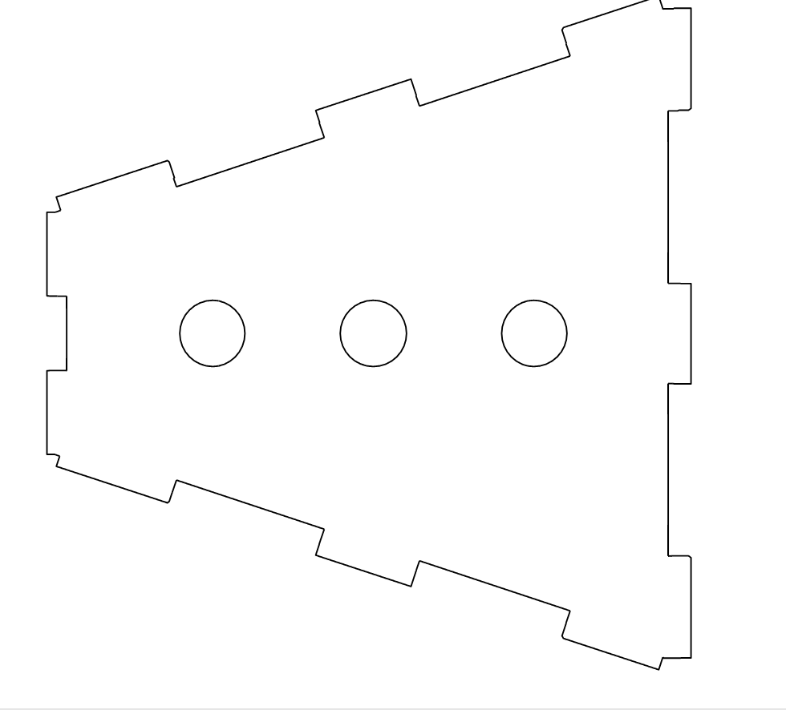
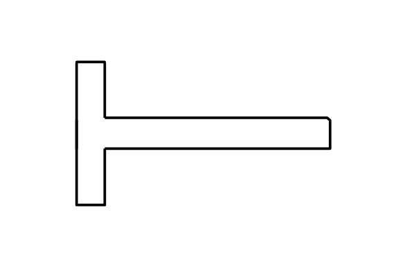
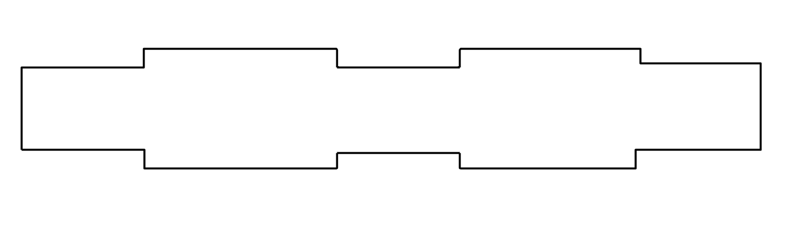
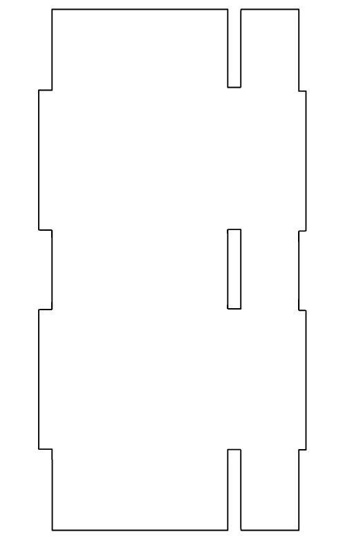
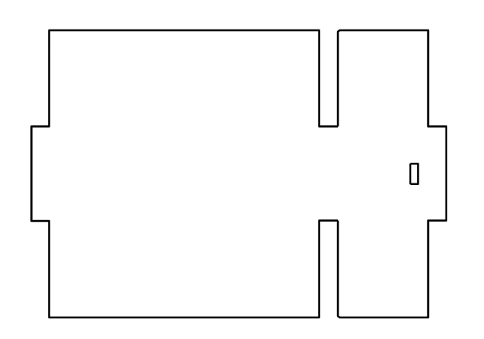
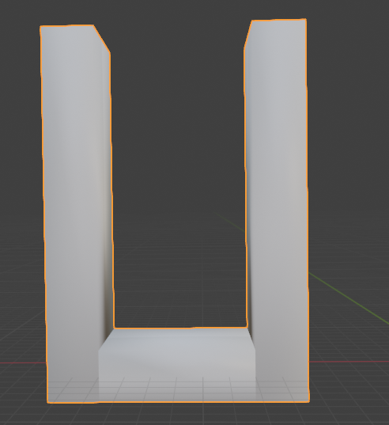
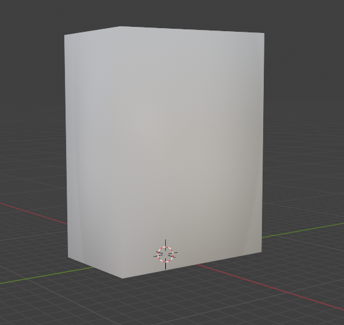
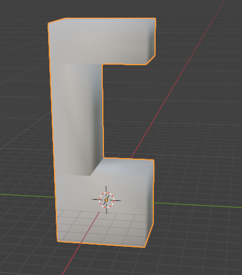

# Shotbot - Autonomous Shot-Serving Robot
## (FOTO FINAL ROBOT)
# Table of Contents
   * [What is this?](#what-is-this)
   * [Requirements](#requirements)
   * [Installation](#installation)
   * [Documentation](#documentation)
   * [Hardware section](#hardware-section)
      * [3D Models](#3d-models)
      * [Components list](#components-list)
      * [Connections](#connections)
   * [Software section](#software-section)
      * [Module 1](#module-1)
      * [Module 2](#module-2)
      * [Module 3](#module-3)
   * [Video](#video)
   * [References](#references)
   * [Authors](#authors)

## What is this?
Robowaiter is a small autonomous robot designed specifically for serving shots (drinks) in a bar setting. This innovative project aims to revolutionize the way drinks are served by leveraging robotics technology. With its compact size and intelligent navigation system, Robowaiter can maneuver through crowded bar spaces with ease, delivering shots efficiently and autonomously. Additionally, it is equipped with a camera for facial recognition and voice recognition capabilities, enhancing its interaction with customers.

## Requirements
- For running the code these are the required languages and libraries:
* [Name](Link)
* --

## Installation
To set up Robowaiter, follow these steps:
1. Clone the repository to your local machine.
2. Navigate to the project directory.
3. Refer to the README files within each component directory for detailed installation instructions.

## Documentation
--

## Hardware section
The hardware library includes all the necessary components and designs for building Robowaiter's physical structure. It contains schematics, 3D designs, and hardware components to help you construct the robot.

### 3D Models
In the 3D library, you'll find printable designs for enclosures, mounts, and other physical structures required for Robowaiter. These designs are available to be 3D printed.
| 3D Piece             | Image                                                               | 3D Piece              | Image                                                                 |
|----------------------|---------------------------------------------------------------------|-----------------------|-----------------------------------------------------------------------|
|     Part superior            |                 | Base              |       |
| Part inferior         |            |   T.svg                 |                      |
| lateral.svg          |              | paret_de_derrera.svg |       |
| paret_davantera.svg  |              | Suport roda motor x2       |      |
| Suport roda boja   |       | Suport valvula x6    |             |

### Components list
| Component                   | Image | Component                   | Image |
|-----------------------------|-------|-----------------------------|-------|
| [Raspberry Pi 4 4GB](https://tienda.bricogeek.com/placas-raspberry-pi/1330-raspberry-pi-4-model-b-4-gb.html)         |       | [Step-Up 3.3V to 12V](https://tienda.bricogeek.com/convertidores-de-voltaje/1004-conversor-step-upstep-down-33v1a-s7v8f3.html)            |      |
| [Controller L298N x4](https://tienda.bricogeek.com/motores/285-controlador-de-motores-doble-puente-h-l298.html?search_query=L298N&results=3)       |      | [Motor Mov](https://tienda.bricogeek.com/motores-dc/1048-motor-con-eje-angulo-recto-y-reductora-481.html?search_query=motor+con+rueda&results=40)      |       |
| [Camera](https://es.aliexpress.com/item/4001162865845.html?spm=a2g0o.ppclist.product.2.3d91WN0rWN0rwh&pdp_npi=2%40dis%21EUR%21%E2%82%AC%203%2C69%21%E2%82%AC%202%2C76%21%21%21%21%21%40211b5dfd16539403796157400e6948%2112000018174400524%21btf&_t=pvid%3A9a5ddde9-5795-4052-80bd-c3985eeb8d6a&afTraceInfo=4001162865845__pc__pcBridgePPC__xxxxxx__1653940380&gatewayAdapt=glo2esp)  |      | [Ultrasound sensor x2](https://tienda.bricogeek.com/sensores-distancia/741-sensor-de-distancia-por-ultrasonidos-hc-sr04.html) |       |
| [Microphone](https://tienda.bricogeek.com/sensores-sonido/383-microfono-electret-preamplificado.html?search_query=microfono&results=20)          |      | [PowerBank 10000mAh](https://www.amazon.es/Coolreall-10000mAh-Compacto-Pantalla-Compatible/dp/B0CQK1GVYD/ref=sr_1_8?dib=eyJ2IjoiMSJ9.BNQ0oJ0R8QnAysp9IQFEWejD_YE23eWgaeKRznOHfHiGOCODNp6GNintnKy4gze6tSG7krS2tmGv6vP1bBvgFzQOOvUIaeoKOEZjKel_ug5zSPl5IRZSyLt7OlZsHQXpcSEpcucIh3UuUmT31DOiQHSIzBnMA9AuKT7jfvlt-MxDQKnXq0Sz6ohRrwD7KDrBRaUzMc0WSQho7DEn2CUYnLdaI_ZXb5ZI_RWgrl5Q8-SiJZ6ay1J2O4bI5lYzwpLgSYmp-I_2GM6H1iaeMp0HpECztmoLt7RYt5mnqcZTDL8.3V1R3WidPHV4eKizSL-cSsSnuR4CghXxhQb2ZRNHKrg&dib_tag=se&keywords=bateria%2Bexterna%2B10000mah&qid=1709653049&sr=8-8&th=1)            |       |
| [Solenoid Valve x3](https://tienda.bricogeek.com/otros-sensores/937-valvula-con-solenoide-12v.html)            |       | [Speaker](https://tienda.bricogeek.com/varios/590-altavoz-5cm-8-ohm-05w.html?search_query=altavoz&results=29)            |      |
| [LDR Fotoresistor x4](https://tienda.bricogeek.com/sensores-luz-infrarrojos/373-fotoresistencia-ldr.html)            |       | [Servo Motor x2](https://tienda.bricogeek.com/motores/118-servomotor-de-rotacion-continua-s3003-360-grados.html?search_query=servo&results=69)            |       |
| [IR Sensor x2](https://www.amazon.es/AZDelivery-infrarrojos-kollissions-obst%C3%A1culos-Detecci%C3%B3n/dp/B07D924JHT/ref=sr_1_5?dib=eyJ2IjoiMSJ9.boGIVuDzM7hVuouV7v5voBn685_8NBEPErCYVJnBtE5WKAHWVM_5j69Er13dMEHxk52uJFn-uXSY_FMQjTSHJ_iKhy3HMqgqcHDhSKWYAZQ9xx3YOuqU7J4Ip7xbVN6pntB1eODfC0CUZzi1DUJ1cZBL5Qw7JP8raphWSgqSTEUBEdiTxty8ysE04cBQDmhZzAwRgvkece4ErxfRKxM50_lbe-yFLy_2OCdWEEpfj3k_VsIS8fpTC7GODLcRYPNoo9vgnB1jEpIn3OAIhvMjkZCb6LNnLakEBmTQApc4AC0.FQcqwUx4-0Rph1_cMOLC17gPpZdQQB6ho7Cg21HW1C4&dib_tag=se&keywords=Arduino%2BIr%2BSensor&qid=1709761946&sr=8-5&th=1)            |       | [Batteries AA 1.5V x6](https://www.amazon.es/Verbatim-Pilas-Alcalino-Cil%C3%ADndrico-pieza/dp/B078TJF9WS/ref=sr_1_25?adgrpid=57795729258&dib=eyJ2IjoiMSJ9.L65noOE9_JgZ5YxJeGpMPpAVkV6TiZwh_KPSOj5x8ru4nhJMlju4TD7dhAZUGJ5dsvgaZwoHRP5AOkeUbM1PMP35-oBbrHNwgx2-sHIw0jgN1QZJMMkROWzQG51A1330Q_del9dCQ7lCLADiUxR4w4hQ8tM2LTn1G7oPyu-y_ADgc0dMgUvAzLHgBYP34AI6jCh1E8xXm6vCy0PCtuaQf03UEtP57_UwH7O2JP5i_zMgnvbtgW6906V5b3RSAYs_OgxDVui54MIQ4-9KdsU3t0S6IdEUjam9Pa4YZjs6HeE.QWQXNrBLZHMTtkF6p3l92fYSgsOD5w1fOYDnQi8Jo4I&dib_tag=se&hvadid=275560441087&hvdev=c&hvlocphy=20270&hvnetw=g&hvqmt=e&hvrand=14782402048233800436&hvtargid=kwd-300162477331&hydadcr=9878_1809596&keywords=pilas+aa&qid=1710949595&sr=8-25)            |       |
| [Wheels x2](https://tienda.bricogeek.com/ruedas-robotica/1609-pareja-de-ruedas-65mm-amarillo.html?search_query=ruedas&results=36)        |       |   [Roda boja](https://fadisel.com/ca/roda-boja-o-roda-robotica/1054-roda-boja-acer-o-13-mm.html)    |       |

### Connections
## (FOTO FRITZING)

## Software section
The software library houses the codebase needed to operate Robowaiter effectively. It encompasses firmware for the robot's embedded systems, as well as any desktop applications or software components essential for seamless integration with the hardware.

### Module 1
--

### Module 2
--

### Module 3
--

## Video
--

## References
- [Link to relevant documentation or external resources]()
- [Tutorials or guides for getting started with Robowaiter]()
- [Any other helpful references related to the project]()

## Authors
- Bonaventura Munill Díaz
- Guillem Cadevall Ferreres
- Marc Serrano Sanz
- Oscar Meca Moñino
